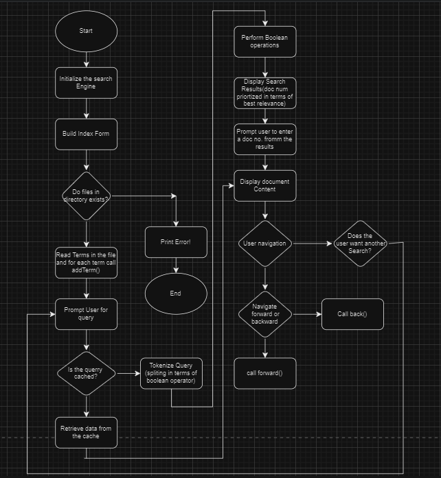

# Search Engine Desktop Application

A desktop file-search engine built in **C++17** with a **Qt Widgets** GUI. It indexes a local folder of `.txt` documents using a hand-written **Trie (prefix tree)** and answers **Boolean (AND / OR) keyword and prefix queries** against them through a Google-style interface — a search box, a paginated results list with titles and snippets, and a full-document reading view.


---

## Table of Contents

- [Features](#features)
- [Tech Stack](#tech-stack)
- [Project Structure](#project-structure)
- [Architecture](#architecture)
- [Data Structures & Algorithms](#data-structures--algorithms)
- [Application Flow](#application-flow)
- [UI Widget Reference](#ui-widget-reference)
- [Requirements](#requirements)
- [Setup & Running](#setup--running)
- [Complexity Analysis](#complexity-analysis)
- [Known Limitations](#known-limitations)
- [Roadmap Ideas](#roadmap-ideas)
- [License](#license)

---

## Features

- **Trie-based inverted index** — each indexed word is inserted character-by-character into a trie; every node stores which documents contain the prefix/word ending at that node and at what frequency (`docFrequency: unordered_map<int, DocInfo>`), giving fast lookups instead of scanning every document per query.
- **Boolean queries** — search terms can be combined with literal `AND` / `OR` tokens (e.g. `network AND security`, `cat OR dog`); results default to a union (OR) when no operator is given.
- **Prefix matching** — because lookups walk the trie to the query term's node and then recursively collect every document under that subtree, partial-word queries also return matches, not just exact terms.
- **Relevance ranking** — for a single term, matching documents are sorted by descending term frequency at that trie node.
- **Query caching** — whole queries (the raw string, including any `AND`/`OR` operators) are cached in `unordered_map<string, vector<int>> searchCache` so an identical repeated query skips re-walking the trie.
- **Paginated results UI** — results are shown 5 at a time; "next page" buttons (`pushButton_2` onward) are revealed dynamically as the result count grows, up to 9 pages (45+ results).
- **Document detail view** — clicking a result's title (a clickable `QLabel` hyperlink) opens the full text of that document in a dedicated `QTextEdit` view.
- **Browsing history scaffolding** — `back()` / `forward()` stack-based navigation between viewed documents exists in `SearchEngine` (not currently wired to a UI control).

## Tech Stack

| Layer | Technology |
|---|---|
| Language | C++17 |
| GUI framework | Qt Widgets (Qt5 or Qt6, auto-detected via `find_package(QT NAMES Qt6 Qt5 ...)`) |
| Build system | CMake ≥ 3.5 |
| UI design | Qt Designer (`gui.ui`, compiled by `CMAKE_AUTOUIC` into `ui_gui.h`) |
| Data structure | Hand-written Trie / inverted index (STL only — `unordered_map`, `vector`, `stack`, `set`, `list`; no external search/database libraries) |

No databases, network calls, or third-party services are used — the app is entirely offline and operates on local `.txt` files.

## Project Structure

```
Search-Engine-Desktop-Application/
├── CMakeLists.txt        # CMake build configuration (Qt5/Qt6 auto-detect)
├── CMakeLists.txt.user   # Qt Creator project/kit settings (local, machine-specific)
├── main.cpp              # Application entry point
├── gui.h / gui.cpp       # Main window class (GUI): search flow, pagination, result rendering
├── gui.ui                # Qt Designer layout for the main window (widget tree, no logic)
├── searchEngine.h         # SearchEngine class: Trie index, indexing, Boolean query engine
├── moc_gui.cpp             # Auto-generated Qt MOC output (build artifact, not hand-edited)
├── gui2.cpp               # Orphaned Qt Creator scaffolding — not part of the build (see note below)
├── mainwindow.h            # Empty leftover header — not part of the build
├── DSA project.docx        # Course write-up / report accompanying the project
└── README.md
```

> **Note on dead files:** `gui2.cpp` and `mainwindow.h` are leftover Qt Creator scaffolding from early project setup. `gui2.cpp` defines a `gui2` class (`QDialog`) that references `gui2.h`/`ui_gui2.h`, neither of which exists in the repo; `mainwindow.h` is empty. **Neither file is listed in `CMakeLists.txt`'s `PROJECT_SOURCES` and neither is compiled.** They can be safely ignored or deleted without affecting the build.

## Architecture

### Entry point (`main.cpp`)

```cpp
QApplication a(argc, argv);
GUI w, w1;
w.show();
return a.exec();
```

Creates a `QApplication`, instantiates the main `GUI` window (note: a second, unused `GUI` instance `w1` is also constructed — see [Known Limitations](#known-limitations)), shows the window, and starts the Qt event loop.

### UI layer (`gui.h` / `gui.cpp`)

The `GUI` class (a `QMainWindow`, backed by `Ui::GUI` generated from `gui.ui`) owns the whole user flow as a single-window, multi-state screen — result panels, the search box, and the document viewer all live in the same `QMainWindow` and are shown/hidden (`setVisible`) rather than being separate windows or a `QStackedWidget`.

1. **Home page** (`home_page()`) — scans `dirPath` for files, strips `.txt` from each name for display, shows the logo image, and reveals the search box (`textEdit_6`) and search button (`pushButton`).
2. **Search** (`on_pushButton_clicked()`) — on clicking the search button: a fresh `SearchEngine` is constructed, `directoryPath` is fully re-indexed via `buildIndexFromFiles()`, the query text is read from `textEdit_6`, and results are fetched via `getDocumentIDs()`.
3. **Results** — for each matching document ID, the corresponding file is read; its first line becomes the **title**, the next few lines are concatenated into a **snippet/body**, and the full text is cached in `FileData` for later use. Up to 5 results are rendered per page as title (`label`…`label_5`, clickable via `linkActivated`) + snippet (`textEdit`…`textEdit_4`). A `switch` on the result count decides how many title/snippet pairs and "next page" buttons to reveal.
4. **Pagination** (`page_generator(int n)`) — recomputes which slice of `L1`/`body` (5 results starting at index `5*n`) to display when a page button is clicked, handling both full and partial (remainder) pages.
5. **Document view** — clicking a result title (`on_label_linkActivated`, etc.) hides the results panel and shows the full document text in `textEdit_7`; a "Home" button (`pushButton_6` / `pushButton_13`) returns to the search screen.

### Indexing / query engine (`searchEngine.h`)

The `SearchEngine` class is the core data structure, implemented entirely in a single header:

- **`TrieNode`** — a node with:
  - `unordered_map<char, TrieNode*> children` — the trie edges, keyed by character.
  - `unordered_map<int, DocInfo> docFrequency` — document ID → `{ int frequency, string filePath }`, populated at every node a word passes through (not just terminal nodes), which is what enables prefix search.
  - `list<vertexNode> adjacentVertices` — an auxiliary co-occurrence list (documents sharing this node), used only by the debug printer `displayTrieStructure()`.
  - `bool isEndOfWord` — marks nodes that are the end of a complete indexed word.
- **`buildIndexFromFiles(directoryPath)`** — scans a directory for `*.txt` files using the Windows `_findfirst`/`_findnext` API, derives each document's numeric ID from the first digit sequence in its filename, whitespace-tokenizes and lowercases its contents, and inserts every word into the trie via `addTerm()`.
- **`getDocumentIDs(query)`** *(public overload, string query)* — splits the query on spaces, recognizes literal `AND`/`OR` tokens, resolves each search term to a set of matching document IDs via the private single-term overload, and combines per-term results by **intersection** (`AND`) or **union with dedup** (`OR`, the default when no operator precedes a term). Whole-query results are memoized in `searchCache`.
- **`getDocumentIDs(termOrPrefix, useAndOperator)`** *(private overload, single term)* — walks the trie character-by-character to the node for the term/prefix; if the path doesn't exist, returns no matches; otherwise collects every document under that subtree via `collectDocumentIDs()`.
- **`collectDocumentIDs(node, sortedDocIDs)`** — recursively unions the `docFrequency` document IDs at `node` with those of every descendant (so a prefix like `"net"` matches `"network"`, `"net"`, `"nets"`, etc.), then sorts the result by descending frequency at the matched node.
- **`intersection()` / `unionOR()`** — set-based helpers for combining per-term result vectors (`unionOR` exists but the inline dedup logic in `getDocumentIDs` is what's actually used for `OR`).
- **`displayDocumentContent()` / `back()` / `forward()`** — console-based document viewer and stack-based (`stack<string> visitedDocuments` / `forwardDocuments`) browsing history; implemented but not called from the GUI.
- **`printIndex()` / `displayTrieStructure()`** — debug helpers that dump the full index to stdout.

## Data Structures & Algorithms

| Concept | Implementation | Purpose |
|---|---|---|
| Inverted index | Trie (`TrieNode` linked structure) | Map every word/prefix to the documents containing it, without scanning full-text on every query |
| Per-node document map | `unordered_map<int, DocInfo>` | O(1) average lookup/update of a document's frequency at a given trie node during indexing |
| Query memoization | `unordered_map<string, vector<int>> searchCache` | Avoid re-walking the trie for a repeated identical query string |
| Boolean combination | `set`/`unordered_set` based intersection & union | Implements `AND` (intersection) / `OR` (union) semantics across multi-term queries |
| Ranking | `std::sort` with a custom comparator on `docFrequency[id].frequency` | Orders same-term matches by relevance (term frequency) |
| Browsing history | `std::stack<string>` (two stacks: back/forward) | Classic two-stack browser history pattern (implemented, not wired to UI) |

## Application Flow


```
main.cpp
  └─ GUI::GUI()  →  home_page()
                       ├─ scan dirPath for files → fileNames / filePaths
                       └─ show search box + logo

User types query → clicks Search (pushButton)
  └─ GUI::on_pushButton_clicked()
        ├─ new SearchEngine
        ├─ buildIndexFromFiles(directoryPath)   // full re-index every search
        ├─ read query text from textEdit_6
        ├─ SearchEngine::getDocumentIDs(query)
        │     ├─ tokenize on spaces, detect AND/OR
        │     ├─ per term: trie walk → collectDocumentIDs() (prefix expansion + freq sort)
        │     └─ combine terms: intersection (AND) / union+dedup (OR)
        ├─ load first lines of each matching file → titles (L1) + snippets (body)
        └─ render up to 5 results (labels + text edits), reveal pagination buttons as needed

User clicks "next page" (pushButton_2 … pushButton_11)
  └─ GUI::page_generator(n) → re-slices L1/body at offset 5*n, updates the 5 visible slots

User clicks a result title (label … label_5, linkActivated)
  └─ GUI::on_label*_linkActivated() → hide results, show full document text in textEdit_7

User clicks Home (pushButton_6 / pushButton_13)
  └─ restore the search screen
```

## UI Widget Reference

Widgets are defined in `gui.ui` and accessed via the generated `ui` pointer in `gui.cpp`. Since the UI has no `QStackedWidget`, screen transitions are implemented purely by toggling `setVisible()` on this fixed widget set:

| Widget(s) | Role |
|---|---|
| `textEdit_6` | Search input box |
| `pushButton` | Search button (triggers `on_pushButton_clicked`) |
| `label_6` | Home-page logo image |
| `label`, `label_2`, `label_3`, `label_4`, `label_5` | Clickable result titles (rendered as HTML `<a>` links; `linkActivated` opens the document) |
| `textEdit`, `textEdit_2`, `textEdit_3`, `textEdit_4` | Result snippets, one per visible result slot |
| `pushButton_2` … `pushButton_11` | Pagination controls ("next page" 0 through 8), revealed based on result count |
| `pushButton_6`, `pushButton_13` | Return to the home/search screen |
| `textEdit_7` | Full-document reading view |
| `scrollArea`, `scrollAreaWidgetContents_3` | Scrollable container for the results panel |

## Requirements

- A C++17-capable compiler (MSVC is recommended — see **Platform note** below)
- [Qt](https://www.qt.io/download) 5 or 6, with the **Widgets** component
- [CMake](https://cmake.org/) ≥ 3.5
- Qt Creator (recommended, since a `CMakeLists.txt.user` Qt Creator project file is included) — or any CMake-compatible IDE/toolchain

### ⚠️ Platform note

The indexing code in `searchEngine.h` uses the Windows-only `<io.h>` / `_findfirst` / `_findnext` / `_findclose` APIs for directory scanning. **This project currently builds and runs on Windows only.** Porting to Linux/macOS would require replacing that directory-scanning code with `std::filesystem` or `<dirent.h>`.

## Setup & Running

### 1. Configure the document directory

The directory that gets indexed and searched, along with the home-page logo image, are **hardcoded absolute paths** in the source (left over from the original author's machine):

- `gui.h` — document directory: `E:\Documents\4th semester\DS\Project Files` (used both as `dirPath` for the home page listing and `directoryPath`, passed to `buildIndexFromFiles`)
- `gui.cpp` — logo image, referenced twice: `E:\Documents\4th semester\DS\Lab\OIP.JPEG` (in `home_page()` and `on_pushButton_6_clicked()`)

Before building, update these paths to point at a real directory/image on your machine. The document directory should contain `.txt` files whose names include a numeric ID (e.g. `doc1.txt`, `file23.txt`) — `buildIndexFromFiles` extracts the first digit sequence in each filename to use as the document's ID, and the GUI indexes files into `fileNames`/`filePaths` by directory listing order, so document IDs should correspond to a 1-based position in that listing (`filePaths[docID-1]`).

### 2. Build

Using Qt Creator (recommended):

1. Open `CMakeLists.txt` as a project.
2. Select a Qt kit with the Widgets component.
3. Build and run.

Using the command line:

```bash
cmake -S . -B build -DCMAKE_PREFIX_PATH="<path-to-your-Qt-installation>\<version>\<compiler>\lib\cmake"
cmake --build build
```

### 3. Run

Launch the resulting `GUI` (`GUI.exe` on Windows) executable.

1. On launch, the home screen lists the indexed directory's files and shows the search box.
2. Enter a search term or Boolean query (e.g. `security AND network`, `cat OR dog`, or a bare prefix like `net`) and press the search button.
3. Click any result title to read the full document; click Home to search again.


## Complexity Analysis

Let `L` = length of a query term, `D` = number of documents matching a subtree, `W` = total words across all indexed documents.

- **Indexing** (`buildIndexFromFiles`): O(W · Lavg) — every word is inserted once, character-by-character.
- **Single-term lookup** (`getDocumentIDs(term, ...)`): O(L) to walk to the term's node, plus O(D) to collect and O(D log D) to sort all documents in the matched subtree by frequency.
- **Multi-term Boolean query**: sum of per-term lookup costs, plus O(N) for set-based intersection/union of the N combined result IDs.
- **Cached repeat query**: O(1) hash lookup in `searchCache` (query string → result vector) — but see [Known Limitations](#known-limitations) regarding the cache's effectiveness in the current wiring.

## Known Limitations

- **Hardcoded paths** — the document directory and logo path are compiled into the binary rather than user-configurable at runtime; the app will not find any documents on a machine other than one with matching paths until these are edited and rebuilt.
- **Windows-only indexing** — see the platform note above.
- **Re-indexes on every search** — a new `SearchEngine` is constructed and the directory is fully re-scanned/re-indexed on each search action rather than being built once at startup, so `searchCache` never persists across searches and has no practical effect.
- **Fixed-slot, non-generic UI** — results are rendered into a hardcoded set of 5 label/textEdit widget pairs with a `switch`/`if` ladder per count rather than a dynamic list layout, capping visible pagination controls at 9 pages (45 results) before overflow is simply not shown.
- **Unused second window** — `main.cpp` constructs an extra, unused `GUI w1` instance alongside the shown window `w`; this wastes a full index/UI construction and should be removed.
- **No tests** — there is currently no automated test suite.
- **No license** — no license file is included in the repository.

## Roadmap Ideas

- Make the document directory and image path user-configurable (settings dialog or config file) instead of hardcoded.
- Build the index once at startup/on directory change rather than per search, so `searchCache` becomes effective.
- Port directory scanning to `std::filesystem` for cross-platform support.
- Replace the fixed 5-slot result UI with a dynamic list (e.g. a `QListWidget` or generated layout) to remove the page-count ceiling.
- Wire up the existing `back()`/`forward()` history methods to UI navigation controls.
- Remove the unused `w1` window instance in `main.cpp` and the dead `gui2.cpp`/`mainwindow.h` scaffolding.
- Add unit tests for the trie/indexing and query logic.

## License

No license has been specified for this project.
